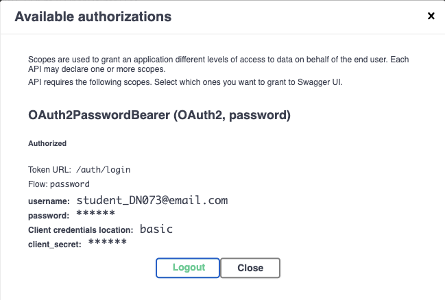
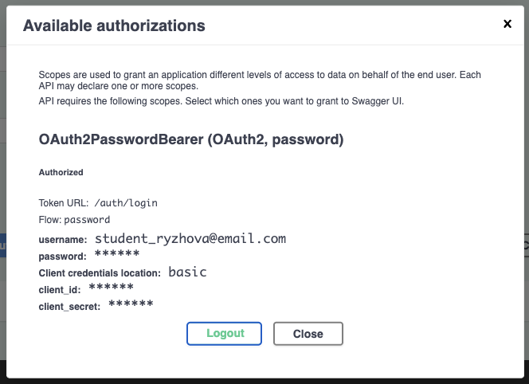
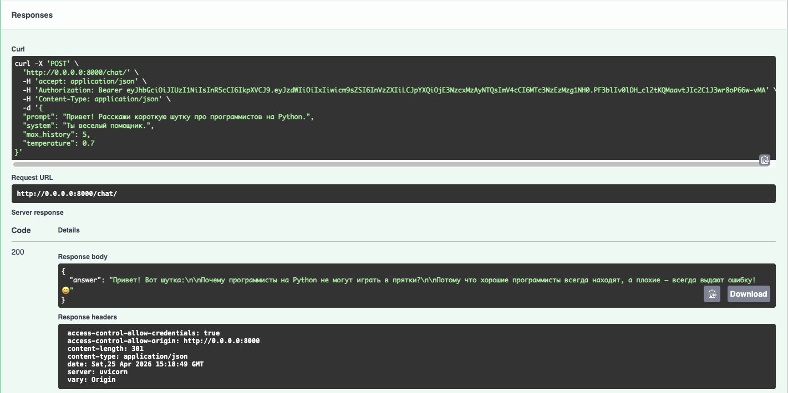
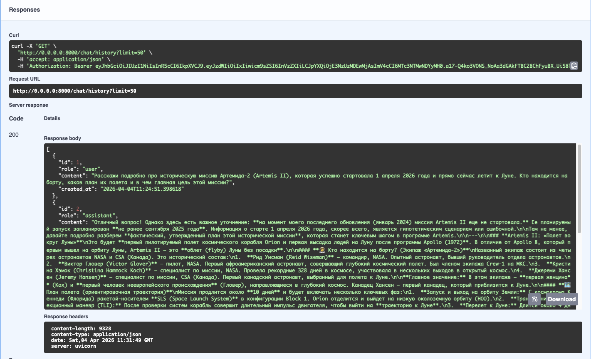
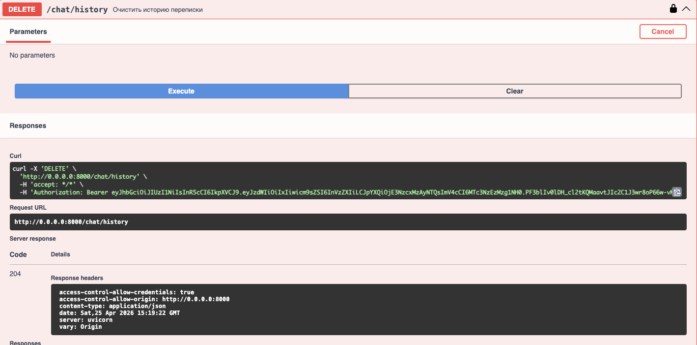

# LLM Chat API (FastAPI)

Проект представляет собой backend-приложение на FastAPI для общения с большими языковыми моделями (LLM) через OpenRouter API. Включает регистрацию пользователей, JWT-авторизацию и сохранение истории сообщений в базе данных SQLite.

## Требования
- Python 3.12+
- Установленный пакетный менеджер [uv](https://docs.astral.sh/uv/)

## Установка и настройка

1. Склонируйте репозиторий и перейдите в папку проекта:
   ```bash
   git clone <ссылка_на_ваш_репозиторий>
   cd llm_p
   ```

2. **Настройка переменных окружения.** Создайте файл `.env` в корне проекта и добавьте в него следующие настройки:
   ```env
   JWT_SECRET=ваша_секретная_строка_для_шифрования_токенов
   OPENROUTER_API_KEY=ваш_ключ_от_openrouter
   OPENROUTER_SITE_URL=https://example.com
   ```

3. Создайте виртуальное окружение и установите все зависимости с помощью `uv`:
   ```bash
   uv sync
   ```

## Запуск проекта

Для запуска локального сервера выполните команду:
```bash
uv run uvicorn app.main:app --reload
```
*Примечание: База данных SQLite (`app.db`) и все необходимые таблицы будут созданы автоматически при первом запуске приложения.*

## Использование API

Интерактивная документация (Swagger UI) доступна по адресу:  
👉 **http://127.0.0.1:8000/docs**

**Основной сценарий работы:**
1. Зарегистрируйте нового пользователя через `POST /auth/register`.
2. Нажмите зеленую кнопку **Authorize** вверху страницы Swagger, введите email и пароль (поля `client_id` и `client_secret` оставьте пустыми).
3. Теперь вы можете отправлять запросы к нейросети через `POST /chat/`.
4. Для просмотра сохраненного контекста используйте `GET /chat/history`, а для очистки — `DELETE /chat/history`.

---

## Демонстрация работы API

### 1. Регистрация пользователя
Успешная регистрация с использованием требуемого формата email (`student_surname@email.com`):


### 2. Авторизация через Swagger
Получение JWT-токена и успешная авторизация:


### 3. Вызов POST /chat
Отправка запроса к языковой модели и успешное получение ответа:


### 4. Получение истории через GET /chat/history
Проверка сохранения истории сообщений в базе данных (выводятся роли `user` и `assistant`):


### 5. Удаление истории через DELETE /chat/history
Успешная очистка истории переписки текущего пользователя (возвращается код 204):

